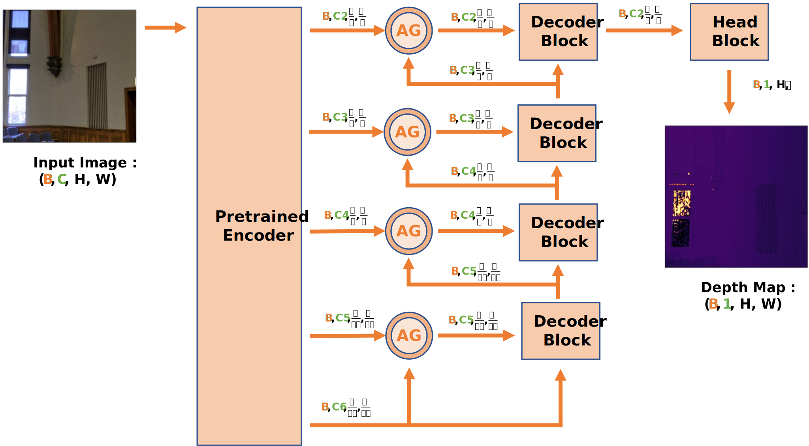
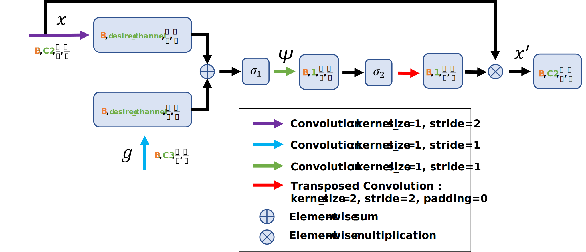
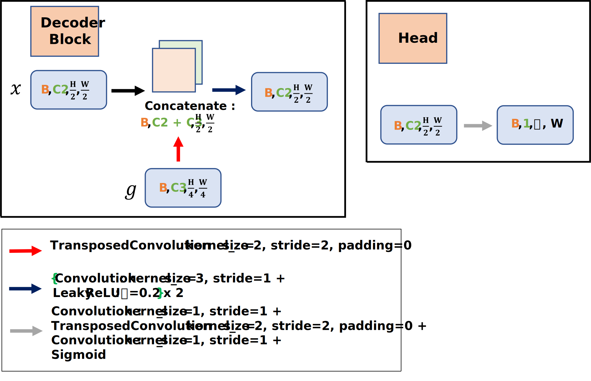

# Deciphering Pixel Insights

---

This repo is the official implementation of <a href="https://doi.org/10.1016/j.jjimei.2024.100216">Deciphering pixel insights: A deep dive into deep learning strategies for enhanced indoor depth estimation</a>.  

## Abstract

Depth estimation is one of the crucial tasks for autonomous systems, which provides important information about
the distance between the system and its surroundings. Traditionally, Light Detection and Ranging and stereo
cameras have been used for distance measurement, despite the significant cost. In contrast, monocular cameras
offer a more cost-effective solution, but lack inherent depth information. The synergy of big data and deep
learning has led to various advanced architectures for monocular depth estimation. However, due to the characteristics of the monocular depth estimation case that is ill posed problem, we incorporate Attention Gates (AG)
within an encoder-decoder based architecture. This helps prevent pattern recognition failures caused by variations in object sizes that share identical depth values. Our research involves evaluating popular pretrained architectures, assessing the impact of using AG, and creating effective head blocks to tackle depth estimation
challenges. Notably, our approach demonstrates improved evaluation metrics on the DIODE dataset, positioning
Attention U-Net as a promising solution. Therefore, utilizing the superior performance obtained by Attention UNet in performing monocular depth estimation on low-cost autonomous systems could relatively reduce the cost
of using lidar or stereo cameras in measuring distance.

## Architecture

<figure>
    
    <figcaption><b>Fig. 1</b> The FCN architecture that we used to examine the capability of the various pre-trained models with AG mechanism for indoor scenes</figcaption>
</figure>

<figure>
    
    <figcaption><b>Fig. 2</b> Attention gates mechanism</figcaption>
</figure>

<figure>
    
    <figcaption><b>Fig. 3</b> Decoder and head blocks to restore the feature map size to the desired depth map size</figcaption>
</figure>

## References

    Pinasthika, K., Utaminingrum, F., Lin, C.Y., Wada, C. and Shih, T.K., 2024. Deciphering pixel insights: A deep dive into deep learning strategies for enhanced indoor depth estimation. International Journal of Information Management Data Insights, 4(1), p.100216.

## Citation

    @article{PINASTHIKA2024100216,
        title = {Deciphering pixel insights: A deep dive into deep learning strategies for enhanced indoor depth estimation},
        journal = {International Journal of Information Management Data Insights},
        volume = {4},
        number = {1},
        pages = {100216},
        year = {2024},
        issn = {2667-0968},
        doi = {https://doi.org/10.1016/j.jjimei.2024.100216},
        url = {https://www.sciencedirect.com/science/article/pii/S2667096824000053},
        author = {Krisna Pinasthika and Fitri Utaminingrum and Chih‑Yang Lin and Chikamune Wada and Timothy K. Shih},
        keywords = {Attention Gates, Computer vision, Deep learning, Fully convolutional networks, Monocular depth estimation, Transfer learning},
        abstract = {Depth estimation is one of the crucial tasks for autonomous systems, which provides important information about the distance between the system and its surroundings. Traditionally, Light Detection and Ranging and stereo cameras have been used for distance measurement, despite the significant cost. In contrast, monocular cameras offer a more cost-effective solution, but lack inherent depth information. The synergy of big data and deep learning has led to various advanced architectures for monocular depth estimation. However, due to the characteristics of the monocular depth estimation case that is ill posed problem, we incorporate Attention Gates (AG) within an encoder-decoder based architecture. This helps prevent pattern recognition failures caused by variations in object sizes that share identical depth values. Our research involves evaluating popular pretrained architectures, assessing the impact of using AG, and creating effective head blocks to tackle depth estimation challenges. Notably, our approach demonstrates improved evaluation metrics on the DIODE dataset, positioning Attention U-Net as a promising solution. Therefore, utilizing the superior performance obtained by Attention U-Net in performing monocular depth estimation on low-cost autonomous systems could relatively reduce the cost of using lidar or stereo cameras in measuring distance.11https://github.com/KrisnaPinasthika/Deciphering-Pixel-Insights}
    }
